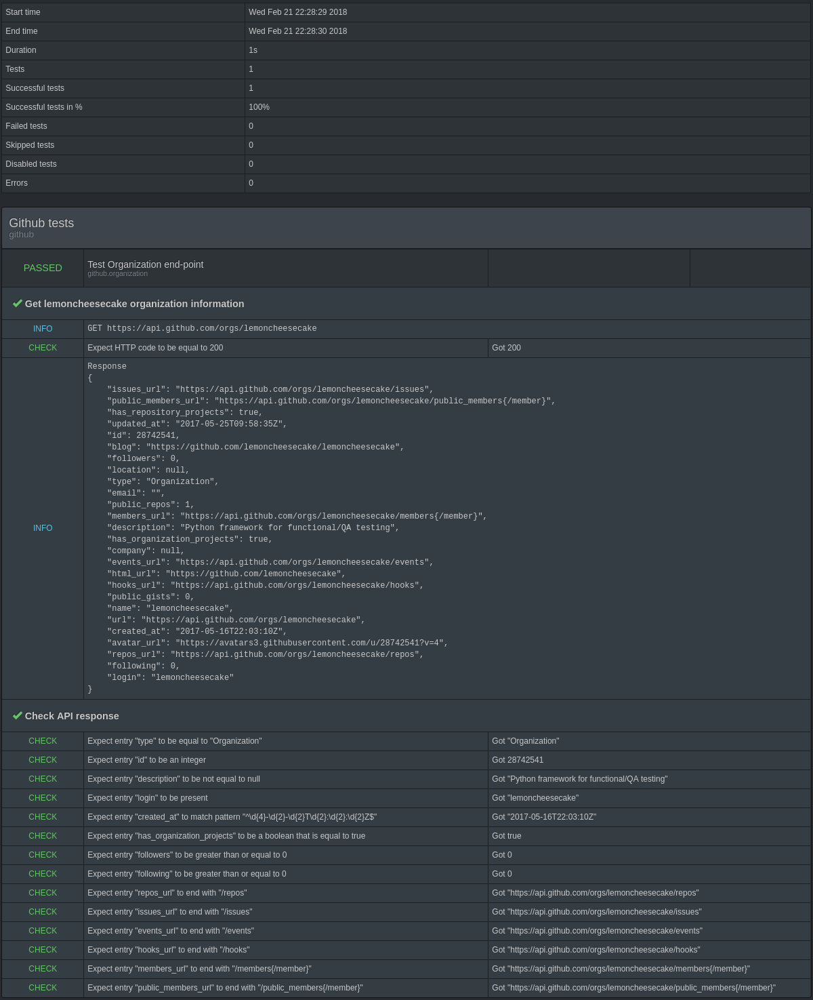

.. lemoncheesecake documentation master file, created by
   sphinx-quickstart on Wed Feb  7 00:13:33 2018.
   You can adapt this file completely to your liking, but it should at least
   contain the root `toctree` directive.

.. _index:

:orphan:

lemoncheesecake: a functional test framework for Python
=======================================================

lemoncheesecake makes reporting the first class citizen while providing modern test features such as
fixtures and matchers.

Here is a test example:

.. code-block:: python

    import json
    import requests

    import lemoncheesecake.api as lcc
    from lemoncheesecake.matching import *

    SUITE = {
        "description": "Github tests"
    }

    URL = "https://api.github.com/orgs/lemoncheesecake"

    @lcc.test("Test Organization end-point")
    def organization():
        lcc.set_step("Get lemoncheesecake organization information")
        lcc.log_info("GET %s" % URL)
        resp = requests.get(URL)
        require_that("HTTP code", resp.status_code, is_(200))
        data = resp.json()
        lcc.log_info("Response\n%s" % json.dumps(data, indent=4))

        lcc.set_step("Check API response")
        check_that_in(
            data,
            "type", is_("Organization"),
            "id", is_integer(),
            "description", is_not_none(),
            "login", is_(present()),
            "created_at", match_pattern("^\d{4}-\d{2}-\d{2}T\d{2}:\d{2}:\d{2}Z$"),
            "has_organization_projects", is_true(),
            "followers", is_(greater_than_or_equal_to(0)),
            "following", is_(greater_than_or_equal_to(0)),
            "repos_url", ends_with("/repos"),
            "issues_url", ends_with("/issues"),
            "events_url", ends_with("/events"),
            "hooks_url", ends_with("/hooks"),
            "members_url", ends_with("/members{/member}"),
            "public_members_url", ends_with("/public_members{/member}")
        )

And here are the corresponding test results:

See :ref:`Getting Started <getting started>` to create your first test project.

Features
--------

- Advanced test hierarchies using suites, tests and nested suites

- Test description and metadata: tags, properties (key=value associations) and links

- Support for test filtering

- Multiple reporting flavors built-in: HTML, JSON, XML, JUnit, ReportPortal, Slack notifications

- Test parallelization

- Rich CLI toolbox

lemoncheesecake is compatible with Python 2.7, 3.4-3.7.

Changelog
---------

The |location_link| will tell you about features, improvements, fixes and possible backward-incompatibilities of each
version.

.. |location_link| raw:: html

   <a href="https://github.com/lemoncheesecake/lemoncheesecake/blob/master/CHANGELOG.md" target="_blank">Changelog</a>

Installation and configuration
------------------------------

- :ref:`Installation <installation>`

- :ref:`Configuring reporting backends <configuring reporting backends>`

Writing tests
-------------

- :ref:`Getting started <getting started>`

- :ref:`Tests and suites organization <tests and suites>`

- :ref:`Using matchers <matchers>`

- :ref:`Logging data <logging>`

- :ref:`Setup and teardown methods <setup_teardown>`, :ref:`fixtures <fixtures>`

- :ref:`Data Driven Testing (DDT) <ddt>`

- :ref:`Test parallelism <parallelism>`

- :ref:`The lcc command line tool and filtering arguments <cli>`

- :ref:`Project customization <project>`

- :ref:`Migrating from to 0.22.x to 1.x <v1 migration guide>`

Contact
-------

Bugs and improvement ideas are welcomed in tickets.
A Google Groups forum is also available for discussions about lemoncheesecake:
https://groups.google.com/forum/#!forum/lemoncheesecake .

License
-------

lemoncheeseake is licensed under the
`Apache License <https://github.com/lemoncheesecake/lemoncheesecake/blob/master/LICENSE.txt>`_
